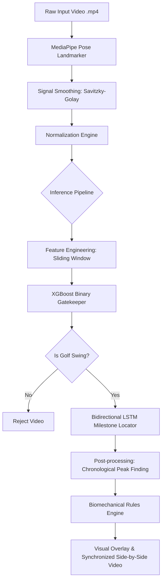

# Technical Architecture: Golf Swing Analyzer

This document details the system architecture, processing pipeline, feature engineering, and model designs of the Golf Swing Analyzer.

---

## 1. System Pipeline Overview

---

## 2. Preprocessing & Normalization Pipeline

### Pose Landmark Extraction
We use the modern **MediaPipe Tasks Pose Landmarker** in `VIDEO` mode to extract 33 pose landmarks (pixel coordinates) from each frame.
* **Person Lock-On**: Naively locks onto the first detected person. Supports filtering out background bystanders.
* **Missing Value Interpolation**: Frames with tracking failures (due to motion blur/occlusions) are filled with linear interpolation across the temporal axis to prevent signal breaks.
* Implementation: [GolfVideoProcessor in data_processor.py](file:///Users/sagar/Documents/ML/golf-analysis/src/data_processor.py#L11)

### Signal Smoothing
To eliminate MediaPipe coordinate micro-jitters, we apply a **Savitzky-Golay Filter** (`window_length=11`, `polyorder=3`) over the raw $x, y$ coordinates of all key joints.

### Center & Scale Normalization
To ensure the pipeline is scale- and resolution-independent, coordinates are normalized relative to physical body proportions:
1. **Centering**: The coordinate system is translated per frame to center at the `mid_hip` midpoint.
   $$\text{mid\_hip} = \frac{\text{left\_hip} + \text{right\_hip}}{2}$$
2. **Torso Scaling**: A static baseline `torso_scale` is calculated as the average Euclidean distance between the `mid_shoulder` and `mid_hip` midpoints over the first 5 frames of the video (assumed to represent the Address pose).
3. **Normalized Output**: Every coordinate $P$ is transformed:
   $$P_{\text{norm}} = \frac{P_{\text{smoothed}} - \text{mid\_hip}_{\text{smoothed}}}{\text{torso\_scale}}$$

---

## 3. Feature Engineering

We use two distinct feature sets depending on the model architecture:

| Feature Set | Dimensionality | Description | Used By |
| :--- | :---: | :--- | :--- |
| **Base Coordinates** | 66 features | Normalized $x, y$ coordinates for all 33 landmarks. | Bidirectional LSTM |
| **Sliding Window** | 98 features | 66 Base features + 32 shifted features ($T-5$ and $T+5$ offsets) for high-movement joints (wrists, elbows, shoulders, hips). | XGBoost Binary Gatekeeper |

* Implementation: [engineer_sliding_window in feature_engineer.py](file:///Users/sagar/Documents/ML/golf-analysis/src/feature_engineer.py#L11)

---

## 4. Models & Inference

### A. Dedicated XGBoost Binary Gatekeeper
* **Purpose**: Rejects non-golf videos (e.g. walking, dancing, empty rooms) to prevent false activations.
* **Input**: 98 sliding window features.
* **Output**: Probability of frame containing a golf swing.
* **Aggregation**: Frame probabilities are aggregated using the mean probability across the video. Videos with a mean probability $\ge 0.7346$ (the optimal threshold) are classified as golf swings.
* **Performance**: 99.0% test accuracy (100% precision, 97.0% recall on test set).
* **Saved Model**: `models/golf_binary_detector.json`

### B. Bidirectional LSTM Milestone Locator
* **Purpose**: Identifies the frame indexes of the 8 critical golf swing milestones.
* **Input**: 66 base coordinate features (processed sequentially).
* **Architecture**: Bidirectional LSTM (TensorFlow/Keras) that outputs a probability distribution across 9 classes (Class 0: transition, Classes 1–8: milestone events).
* **Performance**: Overall Mean Absolute Error (MAE) of **4.65 frames** on the test set.
* **Saved Model**: `models/lstm_phase_model.keras`

---

## 5. Post-processing & Rules (Next Step)

1. **Chronological Sorting Constraint**:
   Since the LSTM outputs independent frame probabilities, a post-processing algorithm (like Viterbi-style paths or dynamic programming) is required to resolve any out-of-order predictions and force $T_1 < T_2 < \dots < T_8$.
2. **Biomechanical Rules Engine**:
   Calculates 2D angles (e.g., Lead Arm Flex, Spine Tilt) at key milestones and triggers text coaching feedback based on threshold deviations.
